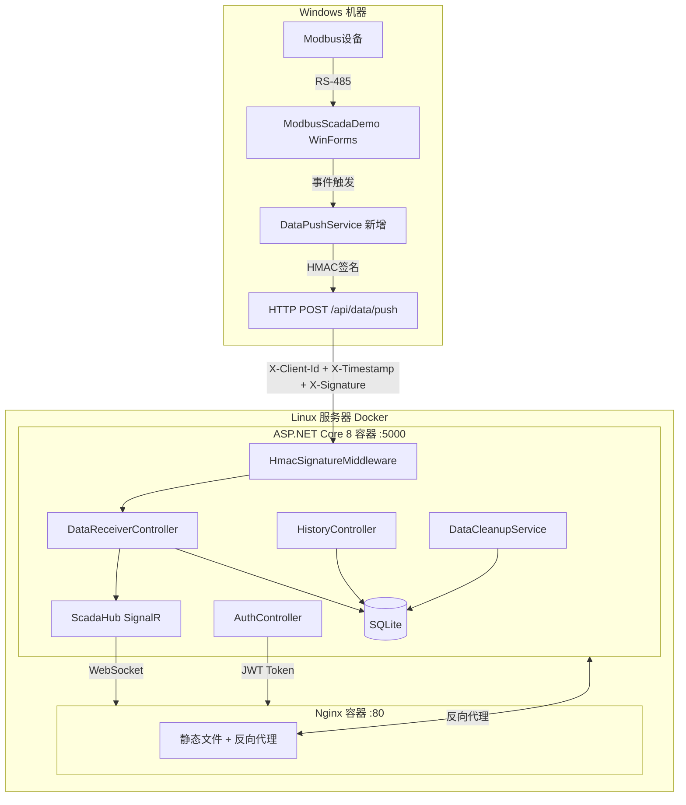
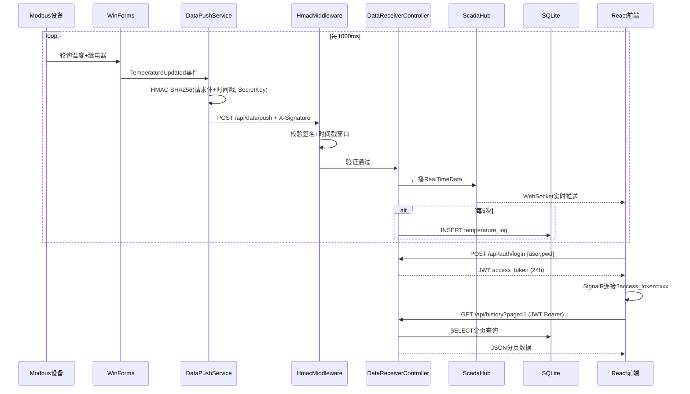

## 产品概述

在现有 ModbusScadaDemo WinForms SCADA 项目中新增 HMAC-SHA256 签名数据推送服务，将实时温度、继电器状态、报警状态通过签名认证的 HTTP POST 推送到 Linux 服务器上的 ASP.NET Core 8 后端。后端通过 SignalR 广播给 React 前端仪表盘页面。整个 Web 端纯只读，不支持任何控制操作。

## 核心功能

- **实时仪表盘**：ECharts 环形温度仪表图（0~120度范围）、继电器仿 LED 发光指示灯（带 box-shadow 光晕）、报警状态红色呼吸动画横幅、阈值 50℃ 只读显示
- **历史曲线图表**：ECharts 折线图展示最近 300 个温度采样点，红色虚线标注报警阈值，Y轴自适应
- **历史数据表格**：分页查询 SQLite、按时间段筛选、CSV 导出
- **双通道安全认证**：
- WinForms → 后端：HMAC-SHA256 签名（请求头 X-Client-Id + X-Timestamp + X-Signature），SecretKey 永不传输，时间戳 5 分钟防重放窗口
- Web 前端 → 后端：JWT 账号密码登录（默认 admin/admin123），token 通过 Bearer 头传递
- **连接状态指示**：展示 WinForms 端串口连接状态（COM口名称、连接/断开）
- **Docker 容器化部署**：双容器编排（Nginx 前端 + ASP.NET Core 后端），docker-compose 一键启动
- **数据自动清理**：SQLite 保留最近 7 天数据，后台定时任务清理过期记录

## 技术栈

| 层 | 技术 | 说明 |
| --- | --- | --- |
| 数据源 | WinForms .NET Framework 4.7.1 | 现有项目，新增 DataPushService + App.config |
| WinForms HTTP | HttpClient + Newtonsoft.Json | 已有 NuGet 依赖，无需新增包 |
| WinForms 签名 | HMAC-SHA256 via System.Security.Cryptography | .NET Framework 内置 |
| 后端 | ASP.NET Core 8 Web API | 接收推送 + HMAC验证 + JWT + SignalR |
| 认证 | HMAC-SHA256 Middleware + JWT Bearer | 双通道独立认证 |
| 实时通信 | SignalR (ASP.NET Core) | WebSocket，JWT 通过 query string |
| 存储 | EF Core 8 + SQLite (WAL模式) | 历史数据持久化 |
| 前端 | React 18 + TypeScript + Vite | SPA 仪表盘 |
| 样式 | Tailwind CSS 3.4.17 | 工业暗色 SCADA 主题 |
| 图表 | ECharts 5 | 仪表图 + 折线图 |
| 前端 HTTP | Axios | REST API + JWT interceptor |
| 容器化 | Docker + docker-compose | 双容器，Alpine Linux |


## 系统架构



## 数据流



## 实现方案

### 一、ModbusScadaDemo 端改动

#### 1.1 App.config 新增（在 `</startup>` 和 `<runtime>` 之间插入 `<appSettings>` 节）

```xml
<appSettings>
  <add key="WebApiUrl" value="http://192.168.1.100:5000" />
  <add key="ClientId" value="scada-push-client" />
  <add key="SecretKey" value="a8f5c2e9d4b73018f6e1b5c3a7d9f20e" />
</appSettings>
```

#### 1.2 Form1.cs 修改（精确3处）

- **第21行后**：添加字段声明 `private DataPushService _dataPushService;`
- **第55行后**（`_modbusDriver.ConnectionLost` 订阅完成后）：初始化 `_dataPushService = new DataPushService(_modbusDriver, _alarmMgr, _serialMgr);`
- **第463行**（`_dataLogger?.Dispose()` 换成 `_dataLogger?.Dispose(); _dataPushService?.Dispose();`）

#### 1.3 Services/DataPushService.cs 新增

- 从 `ConfigurationManager.AppSettings` 读取 `WebApiUrl`、`ClientId`、`SecretKey`
- 订阅三个事件：`TemperatureUpdated`（获取温度+传感器+继电器状态）、`AlarmStateChanged`（缓存报警状态和当前温度）、`ConnectionChanged`（缓存连接状态和端口名）
- 缓存字段：`_lastAlarmActive`、`_lastAlarmTemp`、`_lastConnectionConnected`、`_lastPortName`
- 每次 `TemperatureUpdated` 触发时：

1. 组装完整 JSON：`{ temperature, sensorFault, relayOn, alarmActive, alarmCurrentTemp, alarmThreshold: 50.0, connectionConnected, portName, timestamp }`
2. 获取当前 Unix 时间戳秒
3. 计算签名：`Convert.ToBase64String(HMAC-SHA256("{JSON}\n{timestamp}", SecretKey))`
4. 发送 HTTP POST，附加 `X-Client-Id`、`X-Timestamp`、`X-Signature` 请求头

- 单例 `HttpClient`，异步发送，失败仅 NLog Warn 记录
- `IDisposable` 取消所有事件订阅

#### 1.4 ModbusScadaDemo.csproj 修改

在第121行后添加：`<Compile Include="Services\DataPushService.cs" />`

### 二、ASP.NET Core 8 后端

#### 2.1 项目结构

```
backend/ModbusScadaWeb.Server/
├── ModbusScadaWeb.Server.csproj
├── Program.cs
├── appsettings.json
├── Middleware/
│   └── HmacSignatureMiddleware.cs    # HMAC-SHA256 签名验证
├── Controllers/
│   ├── AuthController.cs             # POST /api/auth/login
│   ├── DataReceiverController.cs     # POST /api/data/push
│   └── HistoryController.cs          # GET /api/history
├── Hubs/
│   └── ScadaHub.cs                   # SignalR Hub
├── Data/
│   ├── ScadaDbContext.cs             # EF Core DbContext
│   └── TemperatureRecord.cs          # 实体类
├── Services/
│   └── DataCleanupService.cs         # IHostedService 7天清理
└── Models/
    └── Dtos.cs                       # 请求/响应 DTO
```

#### 2.2 HMAC 签名验证中间件

- 仅对 `/api/data/push` 路径生效
- 验证逻辑：

1. 提取 `X-Client-Id`、`X-Timestamp`、`X-Signature` 请求头
2. 检查时间戳是否在 ±5 分钟窗口内（防重放）
3. 读取请求体原始 JSON 字符串
4. 根据 ClientId 查找对应 SecretKey（appsettings.json 配置）
5. 计算 `HMAC-SHA256("{body}\n{timestamp}", secretKey)` 并 Base64
6. 与 X-Signature 比对，不一致返回 401

- 验证通过后放行到 Controller

#### 2.3 AuthController

- `POST /api/auth/login`：接收 `{ username, password }`
- 从 appsettings.json `Users` 数组查找用户名
- SHA256 哈希比对密码
- 验证通过返回 `{ access_token, expireAt }`
- JWT 使用 HMAC-SHA256 签名，24h 过期

#### 2.4 DataReceiverController

- 标记 `[ApiExplorerSettings(IgnoreApi = true)]` 不暴露 Swagger
- 接收 JSON → 反序列化 → 调用 ScadaHub 广播 `ReceiveRealTimeData`
- 内部计数器 `_receiveCount`，每5次写入 SQLite
- 写入字段：temperature、relay_state（bool→int）、alarm_state（bool→int）

#### 2.5 SignalR Hub

- `ScadaHub` 标记 `[Authorize]`（JWT 保护）
- 客户端订阅 `ReceiveRealTimeData` 方法
- 在 Program.cs 中配置 `AddJwtBearer` 提取 query string 中的 `access_token`
- 支持自动重连

#### 2.6 HistoryController

- `[Authorize]` JWT 保护
- `GET /api/history?page=1&pageSize=20&startTime=&endTime=`
- EF Core Skip/Take 分页，最大50条/页
- 支持 `startTime`/`endTime` 筛选
- 返回 `{ records, total, page, pageSize }`
- `GET /api/history/stats`：返回温度统计（min/max/avg）

#### 2.7 DataCleanupService

- `IHostedService` 实现，启动后每1小时执行一次
- 删除 `timestamp < NOW - 7天` 的记录
- NLog 记录每次清理的行数

#### 2.8 appsettings.json 结构

```
{
  "ApiKey": {
    "Clients": {
      "scada-push-client": "a8f5c2e9d4b73018f6e1b5c3a7d9f20e"
    }
  },
  "Jwt": {
    "Secret": "your-256-bit-secret-key-minimum-32-chars!!",
    "ExpireHours": 24
  },
  "Users": [
    { "Username": "admin", "PasswordHash": "sha256-of-admin123" }
  ],
  "ConnectionStrings": {
    "Default": "Data Source=scada_web.db"
  },
  "DataRetentionDays": 7
}
```

#### 2.9 性能与可靠性

- SQLite 连接字符串启用 `Journal Mode=WAL` 提升并发读写
- EF Core 使用 `DbContextPool` 复用连接
- DataCleanupService 清理时使用 `ExecuteSqlRaw` 避免加载全部记录

### 三、React 前端

#### 3.1 技术依赖

- react 18、react-dom、react-router-dom 6
- axios（HTTP 客户端，JWT interceptor）
- @microsoft/signalr（SignalR 客户端）
- echarts + echarts-for-react（图表）
- tailwindcss 3.4.17、@tailwindcss/typography
- react-icons、lucide-react（图标）

#### 3.2 路由设计

- `/login` → LoginPage（公开页面）
- `/dashboard` → DashboardPage（ProtectedRoute 守卫，无 token 重定向到 /login）
- `/` → 根据认证状态重定向到 /login 或 /dashboard

#### 3.3 认证流程

1. LoginPage 提交 `{ username, password }` → POST `/api/auth/login`
2. 成功：存储 token 到 `localStorage("scada_token")`
3. Axios 请求拦截器：自动附加 `Authorization: Bearer {token}`
4. Axios 响应拦截器：401/403 → 清除 token → 重定向 /login
5. SignalR 连接：通过 `accessTokenFactory` 回调传递 token

#### 3.4 组件树

```
App
├── Routes
│   ├── LoginPage
│   └── ProtectedRoute → DashboardLayout
│       ├── TopNav（标题 + SignalR连接指示灯 + 实时时钟 + 用户名 + 退出）
│       ├── MainContent（三栏 flex 布局）
│       │   ├── LeftPanel（w-64）
│       │   │   ├── ConnectionCard（COM口 + 连接状态）
│       │   │   └── AlarmCard（阈值50℃ 只读 + 报警状态指示灯）
│       │   ├── CenterPanel（flex-1）
│       │   │   ├── TemperatureGauge（ECharts 环形仪表图）
│       │   │   ├── RelayIndicator（LED 灯珠发光效果）
│       │   │   └── AlarmBanner（红色呼吸动画横幅）
│       │   └── RightPanel（flex-1）
│       │       ├── TabSwitcher（实时曲线 | 历史记录）
│       │       ├── HistoryChart（ECharts 折线图300点滑动）
│       │       └── HistoryTable（分页表格+日期筛选+CSV导出）
│       └── BottomBar（报警摘要 + 最后更新时间）
```

#### 3.5 自定义 Hooks

- `useSignalR(url)`：管理 SignalR 连接生命周期，自动重连，暴露 `realTimeData` 状态和 `isConnected` 状态
- `useHistory()`：管理分页查询状态，`page`、`pageSize`、`startTime`、`endTime`、`records`、`total`、`loading`
- `useAuth()`：提供 `login()`、`logout()`、`token`、`isAuthenticated`

#### 3.6 CSV 导出

- 前端实现，不依赖后端：将历史数据 JSON 在前端通过 `Blob` + `URL.createObjectURL` + `<a>` download 实现
- 列：时间, 温度(℃), 继电器状态, 报警状态

### 四、Docker 部署

#### 4.1 目录结构

```
ModbusScadaWeb/
├── docker-compose.yml
├── .env
├── backend/
│   └── ModbusScadaWeb.Server/
│       ├── Dockerfile
│       └── ...
└── frontend/
    └── modbus-scada-web/
        ├── Dockerfile
        ├── nginx.conf
        └── ...
```

#### 4.2 Dockerfile（后端）

多阶段构建：`mcr.microsoft.com/dotnet/sdk:8.0` 编译 → `mcr.microsoft.com/dotnet/aspnet:8.0` 运行，Alpine 版本

#### 4.3 Dockerfile（前端）

三阶段构建：Node 20 编译 → Nginx Alpine 托管，注入 `nginx.conf`

#### 4.4 docker-compose.yml

- `backend` 容器：端口 5000（内部），volume 挂载 SQLite 文件到宿主机
- `frontend` 容器：端口 80，依赖 backend
- 网络：`scada-net`（bridge）
- nginx.conf 反向代理 `/api/` → `http://backend:5000`，SignalR WebSocket 透传

#### 4.5 环境变量（.env）

```
HMAC_SECRET_KEY=a8f5c2e9d4b73018f6e1b5c3a7d9f20e
JWT_SECRET=your-256-bit-secret-key-minimum-32-chars!!
ADMIN_PASSWORD_HASH=sha256-hash-of-admin123
```

## 设计风格

采用**工业 SCADA 暗色仪表盘**风格，深色背景（#0D1117）搭配高对比度数据指示和玻璃态卡片。温度使用 ECharts 环形仪表图（0~120度），继电器用仿 LED 发光指示灯（带 box-shadow 光晕扩散），报警状态用红色呼吸动画横幅。三栏布局：左侧系统状态面板、中间实时仪表盘、右侧历史数据双 Tab 切换。顶部固定导航栏含登录状态和退出按钮。登录页面独立设计，居中玻璃态卡片配深色渐变背景和网格点阵纹理。

## 登录页面 /login

居中卡片布局，玻璃态半透明面板（backdrop-blur-xl bg-white/5 border border-white/10），左侧品牌区域展示系统名称 "Modbus SCADA" 和温度计 SVG 图标，右侧表单区域包含用户名输入框（带 User 图标前缀）、密码输入框（带 Lock 图标前缀，type=password）、登录按钮（蓝色渐变，hover 提亮）。登录失败显示红色错误提示卡片带 shake 动画，按钮 loading 状态显示旋转 spinner。背景为深色渐变（#0D1117 → #161B22）+ CSS 网格点阵纹理。

## 仪表盘页面 /dashboard

**顶部固定导航栏**（h-14 z-50，bg-[#161B22]/80 backdrop-blur border-b border-white/5）：

- 左侧：系统标题 "Modbus SCADA 温度监控系统"，蓝色渐变下划线装饰（#58A6FF → #1F6FEB）
- 中间：SignalR 连接状态指示灯（绿色圆点 #3FB950 脉冲动画 scale 1→1.3 = 已连接，红色圆点 #F85149 = 断开，灰色 #484F58 = 连接中）
- 右侧：实时数字时钟（每秒更新，monospace 字体）+ 当前用户名标签 + 退出按钮（红色文字 hover 变亮）

主内容区：`pt-14` 避开顶部导航，`h-screen` 三栏 flex 布局，gap-4 p-4

**左侧面板**（w-64，flex flex-col gap-4）：

- 连接状态卡片（bg-[#161B22]/60 rounded-xl border border-white/5 p-4 backdrop-blur）：
- 标题 "连接状态" 小字 #8B949E
- COM 口名称大字 #E6EDF3（如 COM3）
- 连接指示灯（绿色圆点 + "已连接" 或 灰色圆点 + "未连接" 或 橙色 #D29922 + "通信异常"）
- 报警设置卡片（同风格）：
- 标题 "报警阈值" 小字 #8B949E
- 固定值 "50.0 ℃" 大字 #E6EDF3，灰色边框标签 "只读"
- 分隔线 border-white/10
- 当前报警状态：绿色 #3FB950 ✓ "温度正常" 或 红色 #F85149 ⚠ "温度过高" 带 pulse 动画

**中间面板**（flex-1，flex flex-col gap-4 items-center）：

- TemperatureGauge：ECharts 环形仪表图，宽高 280px，深色背景透明，0-120度范围，主刻度线白色，副刻度线 #484F58，蓝色 #58A6FF 指针，中央动态数字温度 "25.5" + 单位 "℃"，传感器故障时中央显示灰色 "---"
- RelayIndicator：LED 灯珠组件，圆形 div w-12 h-12 rounded-full，ON 时 bg-[#3FB950] + box-shadow 0 0 20px rgba(63,185,80,0.6)，OFF 时 bg-[#F85149] + box-shadow 0 0 20px rgba(248,81,73,0.6)，带 transition-all duration-300，下方标签 "风扇状态：运行中 / 已停止"
- AlarmBanner：报警激活时全宽出现，bg-[#F85149]/10 border border-[#F85149]/30 rounded-lg p-3，白色文字 flex items-center gap-2，带 animate-pulse（opacity 0.7-1.0 循环 2s）

**右侧面板**（flex-1，flex flex-col gap-3）：

- Tab 切换器：两个按钮 "实时曲线" "历史记录"，激活态 bg-[#1F6FEB]/20 text-[#58A6FF] border-b-2 border-[#58A6FF]，非激活 text-[#8B949E]
- Tab1 实时曲线：ECharts 折线图，bg-[#161B22] rounded-lg，X轴采样点序号灰色 #484F58，Y轴温度白色，蓝色 #58A6FF 折线 smooth=true lineWidth=2，红色 #F85149 虚线 lineWidth=1.5 标记阈值线，300 点滑动窗口，Y 轴 padding 5℃
- Tab2 历史记录：bg-[#161B22]/60 rounded-xl p-4
- 顶部筛选栏：两个 datetime-local input（开始时间、结束时间）+ 查询按钮 + CSV导出按钮（outline 样式）
- 表格：w-full text-left，thead border-b border-white/10 text-[#8B949E] text-xs uppercase，tbody tr hover:bg-white/5 transition，列：时间（格式 HH:mm:ss）、温度(℃)（数值右对齐）、继电器（ON绿色/ OFF红色 小标签）、报警状态（正常/报警 标签）
- 底部分页：flex justify-between，页码按钮 + "共 X 条记录"

**底部状态栏**（h-8 fixed bottom-0 w-full bg-[#161B22]/80 backdrop-blur border-t border-white/5 px-4 flex items-center justify-between text-xs text-[#8B949E]）：

- 左侧：报警状态文字摘要
- 右侧："最后更新：HH:mm:ss"