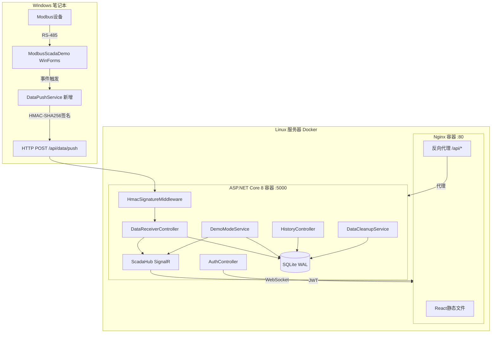
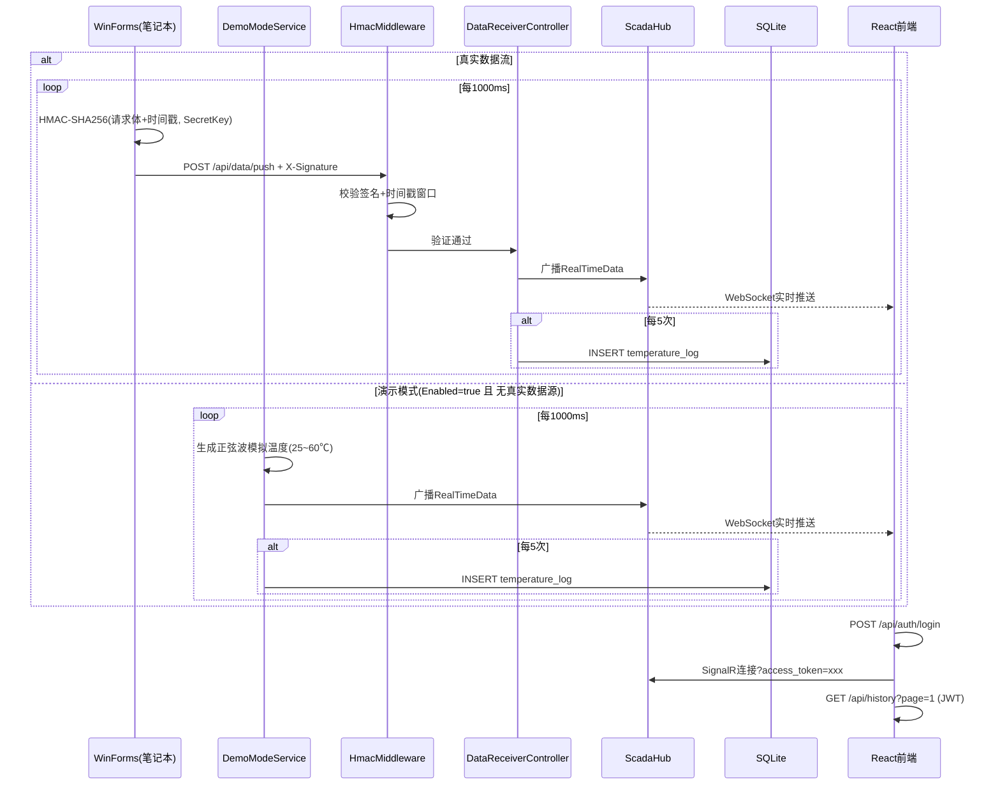

## 产品概述

在现有 ModbusScadaDemo WinForms SCADA 监控系统中新增 HMAC-SHA256 签名数据推送服务，将实时温度、继电器状态、报警状态通过签名认证的 HTTP POST 跨公网推送到 Linux 服务器上的 ASP.NET Core 8 后端。后端通过 SignalR WebSocket 实时广播给 React 前端仪表盘。系统支持**演示模拟模式**——当笔记本电脑未开机或 WinForms 无法推送数据时，后端可自动生成模拟温度数据，确保 Web 端可独立演示。整个 Web 端纯只读，双通道安全认证，Docker Compose 一键部署。

## 核心功能

- **实时仪表盘**：ECharts 环形温度仪表图（0~120度）、继电器仿 LED 发光指示灯（带 box-shadow 光晕扩散）、报警状态红色呼吸动画横幅、阈值 50度只读显示
- **历史曲线图表**：ECharts 折线图展示最近 300 个温度采样点，红色虚线标注报警阈值，Y轴自适应
- **历史数据表格**：分页查询 SQLite、按时间段筛选、CSV 前端导出
- **双通道安全认证**：WinForms 推流使用 HMAC-SHA256 签名（SecretKey 永不传输，5分钟防重放窗口）；Web 前端使用 JWT 账号密码登录（admin/admin123，24h过期）
- **演示模拟模式**：WinForms 离线时，后端可开启正弦波模拟数据生成（基于历史数据统计或默认 25~60度范围），走同一套广播+入库流程，可通过配置开关和运行时 API 控制
- **数据自动清理**：SQLite 保留最近 7 天数据，每小时后台清理过期记录
- **Docker 容器化部署**：Nginx 前端容器 + ASP.NET Core 后端容器，docker-compose 一键启动

## 技术栈

| 层 | 技术 | 说明 |
| --- | --- | --- |
| 数据源 | WinForms .NET Framework 4.7.1 | 现有项目，新增 DataPushService + App.config |
| WinForms 签名 | HMAC-SHA256 (System.Security.Cryptography) | .NET Framework 内置，无需新增 NuGet |
| 后端 | ASP.NET Core 8 Web API | 接收推送 + HMAC验证 + JWT + SignalR + 模拟模式 |
| 认证 | HMAC-SHA256 Middleware + JWT Bearer | 双通道独立认证 |
| 实时通信 | SignalR | WebSocket，JWT 通过 query string access_token |
| 存储 | EF Core 8 + SQLite (WAL 模式) | 历史数据持久化，单文件零配置 |
| 前端 | React 18 + TypeScript + Vite | SPA 仪表盘 |
| 样式 | Tailwind CSS 3.4.17 | 工业暗色 SCADA 主题 |
| 图表 | ECharts 5 | 仪表图 + 折线图 |
| 容器化 | Docker + docker-compose | 双容器（Nginx Alpine + .NET 8 Alpine） |


## 系统架构



## 数据流



## 实现方案

### 一、ModbusScadaDemo 端改动（3个文件修改 + 1个文件新增）

**1.1 App.config 新增**（在 `</startup>` 和 `<runtime>` 之间插入）：

```xml
<appSettings>
  <add key="WebApiUrl" value="http://{公网IP}:5000" />
  <add key="ClientId" value="scada-push-client" />
  <add key="SecretKey" value="a8f5c2e9d4b73018f6e1b5c3a7d9f20e" />
</appSettings>
```

**1.2 Form1.cs 修改（精确3处）**：

- 第21行后：`private DataPushService _dataPushService;`
- 第55行后：`_dataPushService = new DataPushService(_modbusDriver, _alarmMgr, _serialMgr);`
- 第463行：将 `_dataLogger?.Dispose();` 换为 `_dataLogger?.Dispose(); _dataPushService?.Dispose();`

**1.3 Services/DataPushService.cs 新增**：

- 读取 App.config 配置项（WebApiUrl/ClientId/SecretKey）
- 订阅三个事件源缓存最新状态，每次 TemperatureUpdated 触发时组装完整 JSON
- HMAC-SHA256 签名计算、X-Signature 请求头附加、单例 HttpClient 异步发送
- 失败仅 NLog Warn 记录，不阻塞主程序

**1.4 .csproj 新增**：第121行后添加 `<Compile Include="Services\DataPushService.cs" />`

### 二、ASP.NET Core 8 后端

**项目结构**：

```
backend/ModbusScadaWeb.Server/
├── Program.cs
├── appsettings.json
├── Middleware/HmacSignatureMiddleware.cs
├── Controllers/
│   ├── AuthController.cs          # POST /api/auth/login
│   ├── DataReceiverController.cs  # POST /api/data/push
│   ├── HistoryController.cs       # GET /api/history
│   └── DemoController.cs          # POST /api/demo/toggle, GET /api/demo/status
├── Hubs/ScadaHub.cs
├── Services/
│   ├── DemoModeService.cs         # IHostedService 模拟数据生成
│   └── DataCleanupService.cs      # IHostedService 7天清理
├── Data/
│   ├── ScadaDbContext.cs
│   └── TemperatureRecord.cs
└── Models/Dtos.cs
```

**DemoModeService 设计**：

- 实现 `IHostedService`，通过 `DemoMode:Enabled` 配置控制启动
- 首次启动时从 SQLite 查询最近 300 条温度数据的 min/max/avg 作为模拟基准
- 无历史数据时回退默认正弦波：`25 + 17.5 * sin(tick * 0.1) + 17.5`（25~60度范围）
- 每 10 个周期生成一次超阈值温度（55~65度随机），用于演示报警效果
- 伴随生成 relay_state（温度>50=true）和 alarm_state（温度>50=true）
- 定时器每 1000ms 触发，通过 ScadaHub 广播 + 每5次 SQLite 入库
- 可通过 `POST /api/demo/toggle` 运行时开关，`GET /api/demo/status` 查询状态
- 当收到真实推送数据时自动暂停模拟（可选，由 `DemoMode:AutoPauseOnRealData` 配置控制）

**HMAC 中间件**：仅对 `/api/data/push` 生效，提取 X-Client-Id、X-Timestamp、X-Signature，校验时间戳±5分钟窗口，计算并比对 HMAC-SHA256 签名。验证通过后重置模拟暂停计时器。

**认证**：AuthController 从 appsettings.json Users 数组查找用户名，SHA256 哈希比对密码，返回 JWT（HMAC-SHA256签名，24h过期）。HistoryController、ScadaHub 标记 [Authorize]。SignalR 在 Program.cs 中配置 `AddJwtBearer` 从 query string 提取 access_token。

### 三、React 前端

**路由**：`/login` 公开页面 → 登录成功 → `/dashboard`（ProtectedRoute 守卫）

**组件树**：

```
App → Routes
  ├── LoginPage（玻璃态卡片+用户名密码表单+shake动画）
  └── DashboardLayout（三栏 flex）
      ├── TopNav（标题 + SignalR指示灯 + 时钟 + 演示模式标签 + 退出）
      ├── LeftPanel（ConnectionCard + AlarmCard 只读）
      ├── CenterPanel（TemperatureGauge ECharts仪表图 + RelayIndicator LED灯珠 + AlarmBanner呼吸动画）
      ├── RightPanel（Tab切换: HistoryChart折线图300点 + HistoryTable分页表格+日期筛选+CSV导出）
      └── BottomBar（报警摘要 + 最后更新时间）
```

**Hooks**：`useSignalR`（JWT token传递、自动重连）、`useHistory`（分页查询状态管理）、`useAuth`（登录/登出/401拦截重定向）

### 四、Docker 部署

**docker-compose.yml**：backend容器（:5000内部，volume挂载SQLite文件）、frontend容器（:80，依赖backend）、`scada-net` 网络桥接。nginx.conf 反向代理 `/api/` → `http://backend:5000`，SignalR WebSocket 透传。

**.env**：HMAC_SECRET_KEY、JWT_SECRET、ADMIN_PASSWORD_HASH、DEMO_MODE_ENABLED。

### 五、appsettings.json 结构

```
{
  "ApiKey": {
    "Clients": {
      "scada-push-client": "a8f5c2e9d4b73018f6e1b5c3a7d9f20e"
    }
  },
  "Jwt": { "Secret": "your-256-bit-secret-key-minimum-32-chars!!", "ExpireHours": 24 },
  "Users": [{ "Username": "admin", "PasswordHash": "SHA256-of-admin123" }],
  "ConnectionStrings": { "Default": "Data Source=scada_web.db;Journal Mode=WAL" },
  "DataRetentionDays": 7,
  "DemoMode": {
    "Enabled": false,
    "IntervalMs": 1000,
    "MinTemperature": 25.0,
    "MaxTemperature": 60.0,
    "AlarmInterval": 10,
    "AutoPauseOnRealData": true,
    "PauseTimeoutMinutes": 5
  }
}
```

### 六、性能与可靠性

- WinForms 单例 HttpClient，1Hz 推送频率
- SQLite WAL 模式提升并发读写，EF Core DbContextPool 复用连接
- DataCleanupService 使用 ExecuteSqlRaw 直接删除避免加载全量数据
- ECharts 前端 300 点滑动窗口，shift+push 零开销
- HMAC 中间件高效路由过滤（仅 /api/data/push 路径生效）
- 演示模式自动暂停机制避免与真实数据冲突

采用工业 SCADA 暗色仪表盘风格，深色背景（#0D1117）搭配高对比度数据指示和玻璃态卡片。温度使用 ECharts 环形仪表图（0~120度），继电器用仿 LED 发光指示灯（带 box-shadow 光晕扩散），报警状态用红色呼吸动画横幅。三栏布局：左侧系统状态面板、中间实时仪表盘、右侧历史数据双 Tab 切换。顶部固定导航栏含登录状态、演示模式标签和退出按钮。登录页面独立设计，居中玻璃态卡片配深色渐变背景和 CSS 网格点阵纹理。