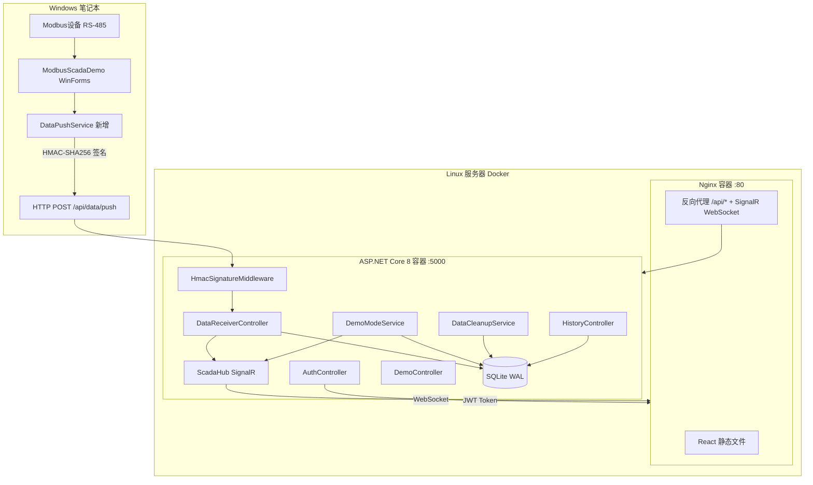
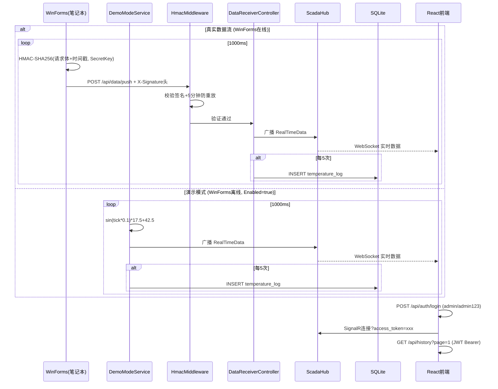

## 产品概述

在现有 ModbusScadaDemo WinForms SCADA 监控系统中新增 HMAC-SHA256 签名数据推送服务，将实时温度、继电器状态、报警状态通过签名认证 HTTP POST 跨公网推送到 Linux 服务器上的 ASP.NET Core 8 后端。后端通过 SignalR WebSocket 实时广播给 React 前端仪表盘。系统支持演示模拟模式——当 WinForms 离线时自动生成模拟温度数据，确保 Web 端可独立运行。Web 前端支持浅色/暗黑双主题切换。整体纯只读，双通道安全认证，Docker Compose 一键部署。

## 核心功能

- **实时仪表盘**：ECharts 环形温度仪表图（0~120度范围）、继电器仿 LED 发光指示灯（box-shadow 光晕扩散）、报警状态红色呼吸动画横幅、阈值 50 度只读显示，适配浅色/暗黑双主题
- **历史曲线图表**：ECharts 折线图展示最近 300 个温度采样点，红色虚线标注报警阈值，Y 轴自适应，图表颜色跟随主题切换
- **历史数据表格**：分页查询 SQLite、按时间段筛选、CSV 前端导出
- **双通道安全认证**：WinForms 推流使用 HMAC-SHA256 签名（SecretKey 永不传输，X-Timestamp 5 分钟防重放窗口）；Web 前端 JWT 账号密码登录（admin/admin123，24h 过期，SignalR query string 传递）
- **演示模拟模式**：WinForms 离线时后端生成正弦波模拟温度（25~60℃，周期性触发报警），配置开关+运行时 API 控制，收到真实数据自动暂停
- **浅色/暗黑双主题**：顶部导航栏主题切换按钮（Sun/Moon 图标），localStorage 持久化选择，Tailwind dark class 策略，ECharts 图表自适应主题色
- **数据自动清理**：SQLite 保留最近 7 天数据，后台定时清理
- **Docker 容器化**：双容器编排（Nginx :80 + .NET :5000 内部），docker-compose 一键启动

## 技术栈

| 层 | 技术 | 说明 |
| --- | --- | --- |
| 数据源 | WinForms .NET Framework 4.7.1 | 现有项目，新增 DataPushService + App.config |
| WinForms 序列化 | Newtonsoft.Json | 已有 NuGet 依赖 |
| WinForms 签名 | HMAC-SHA256 (System.Security.Cryptography) | .NET Framework 内置 |
| 后端运行时 | ASP.NET Core 8 | 跨平台，Alpine Linux 容器 |
| 实时通信 | SignalR | WebSocket，JWT query string token |
| 存储 | EF Core 8 + SQLite (WAL 模式) | HistoryController 分页查询 |
| 前端框架 | React 18 + TypeScript + Vite 5 | SPA 仪表盘 |
| 样式 | Tailwind CSS 3.4.17 + tailwind-merge + tailwindcss-animate | dark class 双主题策略 |
| 图表 | ECharts 5 | 仪表图 + 折线图，自适应主题 |
| 图标 | lucide-react | Sun/Moon 主题切换等 |
| HTTP | Axios | JWT interceptor |
| 容器化 | Docker + docker-compose | Alpine，双容器编排 |


## 系统架构



## 数据流



## 核心实现策略

### 1. ModbusScadaDemo 端改动

**修改文件 3 个 + 新增 1 个**：

- **App.config**：`</startup>` 和 `<runtime>` 之间插入 `<appSettings>` 节，配置 WebApiUrl（http://公网IP:5000）、ClientId（scada-push-client）、SecretKey（32 位随机字符串）
- **Form1.cs（3 行）**：行 21 后加 `private DataPushService _dataPushService;`，行 55 后加 `_dataPushService = new DataPushService(_modbusDriver, _alarmMgr, _serialMgr);`，行 463 替换为 `_dataLogger?.Dispose(); _dataPushService?.Dispose();`
- **.csproj（1 行）**：行 121 后加 `<Compile Include="Services\DataPushService.cs" />`
- **Services/DataPushService.cs（新增）**：
- 从 `ConfigurationManager.AppSettings` 读取配置
- 订阅 `_modbusDriver.TemperatureUpdated`、`_alarmMgr.AlarmStateChanged`、`_serialMgr.ConnectionChanged`
- 缓存 `_lastAlarmActive`、`_lastAlarmTemp`、`_lastConnected`、`_lastPortName`
- 每次 `TemperatureUpdated` 触发时组装 JSON、计算 HMAC-SHA256 签名、单例 HttpClient 异步 POST
- 失败仅 `_logger.Warn` 记录，不抛异常，`IDisposable` 取消事件

### 2. ASP.NET Core 8 后端（backend/ModbusScadaWeb.Server/）

**项目结构**：

```
Middleware/HmacSignatureMiddleware.cs    # 签名校验，仅拦截 /api/data/push
Controllers/AuthController.cs            # POST /api/auth/login
Controllers/DataReceiverController.cs    # POST /api/data/push (HMAC保护)
Controllers/HistoryController.cs         # GET /api/history (JWT保护)
Controllers/DemoController.cs            # POST /api/demo/toggle, GET /api/demo/status
Hubs/ScadaHub.cs                         # SignalR Hub [Authorize]
Services/DemoModeService.cs              # IHostedService 正弦波模拟
Services/DataCleanupService.cs           # IHostedService 7天清理
Data/ScadaDbContext.cs                   # EF Core DbContext + TemperatureRecord
Models/Dtos.cs                           # LoginRequest, PushDataDto, HistoryPage 等
Program.cs                               # DI 注册 + 中间件管道
appsettings.json                         # 全部配置
```

**HMAC 中间件**：仅 `/api/data/push` 路径生效。提取 X-Client-Id、X-Timestamp、X-Signature 请求头，读取原始请求体，根据 ClientId 查找 SecretKey，计算比对 HMAC-SHA256。时间戳 ±5 分钟防重放。

**DemoModeService**：`IHostedService`，`DemoMode:Enabled=true` 时启动。无历史数据时默认 `25+Math.Sin(tick*0.1)*17.5+17.5`（25~60 度范围）。每 10 周期生成超阈值温度演示报警。每 1 秒通过 `IScadaHub` 广播 + 每 5 次 EF Core 入库。监听真实数据后自动暂停 5 分钟。

**appsettings.json**：

```
{
  "ApiKey": { "Clients": { "scada-push-client": "a8f5c2e9d4b73018f6e1b5c3a7d9f20e" } },
  "Jwt": { "Secret": "your-256-bit-secret-key-minimum-32-chars!!", "ExpireHours": 24 },
  "Users": [{ "Username": "admin", "PasswordHash": "SHA256-of-admin123" }],
  "ConnectionStrings": { "Default": "Data Source=scada_web.db;Journal Mode=WAL" },
  "DataRetentionDays": 7,
  "DemoMode": { "Enabled": false, "IntervalMs": 1000, "MinTemperature": 25.0, "MaxTemperature": 60.0, "AlarmInterval": 10, "AutoPauseOnRealData": true, "PauseTimeoutMinutes": 5 }
}
```

### 3. React 前端（frontend/modbus-scada-web/）

**双主题策略**：Tailwind `darkMode: 'class'`，`<html class="dark">` 控制。`useTheme` Hook 管理状态，`localStorage("scada_theme")` 持久化，默认暗黑模式。ECharts 通过 `echarts.getInstanceByDom` 监听主题变化重新 `setOption`。

**路由**：`/login`（公开）→ `/dashboard`（ProtectedRoute 守卫，无 token 跳 /login）。

**组件树**：

```
App → Routes
  ├── LoginPage（玻璃态卡片 + 用户名密码 + shake 错误动画）
  └── DashboardLayout（三栏 flex）
      ├── TopNav（标题 + SignalR指示灯脉冲 + 实时时钟 + Sun/Moon切换按钮 + 演示模式标签 + 用户名 + 退出）
      ├── LeftPanel（ConnectionCard 串口状态 + AlarmCard 阈值只读）
      ├── CenterPanel（TemperatureGauge ECharts仪表图 280px + RelayIndicator LED灯珠 + AlarmBanner 呼吸动画）
      ├── RightPanel（Tab: 实时曲线ECharts 300点 + 历史记录Table分页+日期筛选+CSV导出）
      └── BottomBar（报警摘要 + 最后更新时间）
```

**Hooks**：`useSignalR`（JWT token 传递收工厂、自动重连）、`useHistory`（分页查询）、`useAuth`（login/logout/401 拦截）、`useTheme`（dark/light 切换+ECharts 重渲染）。

### 4. Docker 部署

- **docker-compose.yml**：backend 容器（:5000 内部，volume 挂载 SQLite 文件）、frontend 容器（:80，depends_on backend）、scada-net 桥接网络
- **nginx.conf**：`location /api/` 反向代理 `http://backend:5000`，`/hubs/` WebSocket 透传，`/` 静态文件
- **.env**：HMAC_SECRET_KEY、JWT_SECRET、ADMIN_PASSWORD_HASH、DEMO_MODE_ENABLED

## 设计风格

工业 SCADA 仪表盘风格，支持浅色/暗黑两种模式。暗黑模式为默认：深色背景搭配高对比度数据指示和玻璃态卡片，霓虹光晕效果。浅色模式：明亮背景、卡片阴影替代光晕，保持同等数据对比度。温度使用 ECharts 环形仪表图，继电器用仿 LED 发光指示灯，报警用红色呼吸动画横幅。三栏布局，顶部固定导航栏含主题切换按钮。

## 双主题色彩方案

**暗黑模式（默认）**：背景 #0D1117 / #161B22 / #21262D，文字 #E6EDF3 / #8B949E，主色 #58A6FF，功能色 #3FB950(成功) / #F85149(报警) / #D29922(警告)。玻璃态卡片 bg-white/5 backdrop-blur-xl border-white/10。LED 灯珠 box-shadow 发光。

**浅色模式**：背景 #F0F2F5 / #FFFFFF / #E8EAED，文字 #1A1A2E / #6B7280，主色 #1F6FEB，功能色保持与暗黑一致。卡片 bg-white shadow-md border-gray-200。LED 灯珠降低光晕强度。

**主题切换**：Tailwind `darkMode: 'class'`，`<html class="dark">` 控制。顶部导航栏 Sun/Moon 图标按钮（lucide-react），`localStorage("scada_theme")` 持久化。ECharts 实例监听 `document.documentElement.classList` 变化，重新 `setOption` 更新图表颜色。

## 登录页面 /login

居中卡片布局，玻璃态半透明面板（backdrop-blur-xl bg-white/5 border border-white/10，浅色模式 bg-white shadow-xl）。左侧品牌区域展示系统名称 "Modbus SCADA" 和温度计 SVG 图标，右侧表单区域用户名输入框（lucide-react User 图标前缀）、密码输入框（Lock 图标前缀）、登录按钮（蓝色渐变 hover 提亮）。登录失败红色错误提示卡片 shake 动画，按钮 loading 旋转 spinner。背景为深色渐变 + CSS 网格点阵纹理（浅色模式浅灰点阵）。

## 仪表盘页面 /dashboard

**顶部固定导航栏**（h-14 z-50，暗黑 bg-[#161B22]/80 backdrop-blur border-b border-white/5，浅色 bg-white/90 shadow-sm border-gray-200）：

- 左侧：系统标题 "Modbus SCADA 温度监控系统"，蓝色渐变下划线
- 中间：SignalR 连接指示灯（绿色脉冲动画 scale 已连接 / 红色 断开 / 灰色 连接中）+ 数据来源标签（"真实数据"/"演示模式"）
- 右侧：主题切换按钮 Sun/Moon 图标 + 实时数字时钟 monospace + 用户名 + 退出按钮

主内容区 `pt-14 h-screen`，三栏 flex 布局 gap-4 p-4。

**左侧面板**（w-64 flex flex-col gap-4）：

- ConnectionCard：COM 口名称大字 + 连接指示灯（绿/灰/橙）
- AlarmCard：固定阈值 "50.0 ℃" + 只读标签 + 当前报警状态（绿 ✓ / 红 ⚠ pulse）

**中间面板**（flex-1，flex flex-col gap-4 items-center）：

- TemperatureGauge：ECharts 环形仪表图 280px，深色/浅色背景自适应，蓝色指针，0-120 度，中央动态温度 + "℃"
- RelayIndicator：LED 灯珠 w-12 h-12 rounded-full，ON 绿 #3FB950 + box-shadow 光晕，OFF 红 #F85149，transition-all duration-300
- AlarmBanner：激活时全宽红底半透明 + border，animate-pulse 呼吸动画

**右侧面板**（flex-1，flex flex-col gap-3）：

- Tab 切换："实时曲线" "历史记录"，激活态蓝色底线
- Tab1：ECharts 折线图，蓝色平滑折线，红色虚线阈值线，300 点滑动窗口
- Tab2：表格 + 顶部 datetime-local 筛选 + 查询按钮 + CSV 导出按钮（outline 样式），底部分页 "共 X 条"

**底部状态栏**（h-8 fixed bottom-0 w-full）：报警摘要 + 最后更新时间